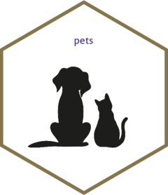

<!-- README.md is generated from README.Rmd. Please edit that file -->

# pets 

The goal of pets is to provide a simple means for people to express
their feelings about pets. At present, the package only contains one
function: `cats()`.

## Installation

You can install the development version from
[GitHub](https://github.com/) with:

``` r
# install.packages("devtools")
devtools::install_github("j-e-morris/pets")
```

## Error reporting

If you find an error or bug, please file an issue.

## Example

Here are two simple examples that allow you to express your feelings
about cats:

``` r
library(pets)

## if you like cats
cats(TRUE)
#> [1] "I love cats!"

## if you don't like cats
cats(FALSE)
#> [1] "I am not a cat person."
```
